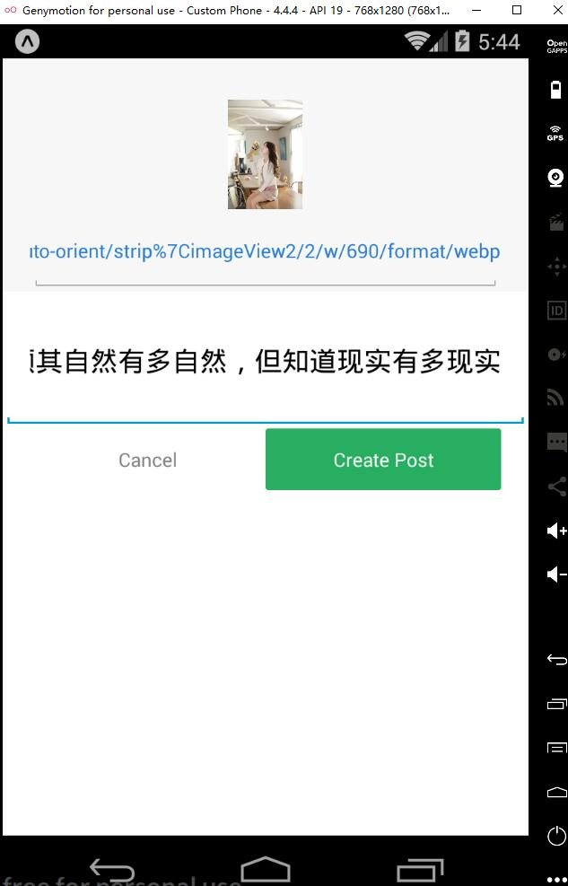

# react-native-apollo-example

A demo for study GraphQL & React Native 

## Dependencies

* React Native
* Express
* Mongoose
* Apollo

## Install

Install npm modules.

```shell
npm run app-install

```

edit `.env` database info

## Configure Database

Create a table called `posts` including two fields `_id` and `description`、`imageUrl`

Add some mock data manually

## Build & Test

### Client

```shell
cd client && npm run android or ios
```


### Server

```shell
cd server && npm run start
```

GraphQL Endpoint: `http://localhost:3000`


### GraphiQL query page test

Open `http://localhost:3000/graphiql`

test:

```bash

### 查询文章
query {
  posts{
    id
    description
  }
}

### 新增文章
# mutation{
#   createPost(description:"test"){
#     id,
#     description
#   }
# }

### 操作名称
### 变量参数
### {
###   "description":"sdfsdf"
### }
# mutation CreatePostForTest($description:String!){
#   createPost(description:$description){
#     id,
#     description
#   }
# }

### 更新文章
# mutation{
#   updatePost(id:"5b62b95e530ec2571455773b",description:"giscafer"){
#     id,
#     description
#   }
# }


### 别名
# {
#   postOne: post(id: "5b62b95e530ec2571455773b") {
#     id,
#     description
#   }
#   postTwo: post(id: "5b62b961530ec2571455773c") {
#     id,
#     description
#   }
# }


### 片段
# {
#   leftComparison: post(id: "5b62b95e530ec2571455773b") {
#     ...comparisonFields
#   }
#   rightComparison: post(id: "5b62b961530ec2571455773c") {
#     ...comparisonFields
#   }
# }

# fragment comparisonFields on Post {
#   id
#   description
# }

```


## Related Article

- [How to use `create-react-native-app` with GraphQL & Apollo](https://www.prisma.io/blog/tutorial-using-create-react-native-app-with-graphql-apollo-e630aee3ae1e/)


## Issues

- [React Native 错误合集&解决方案](https://github.com/giscafer/front-end-manual/issues/19)


## Screenshot




## Related Project

- [Angular-GraphQL-Express-Demo](https://github.com/giscafer/Angular-GraphQL-Express-Demo)


## License

MIT

---

> [giscafer.com](http://giscafer.com) &nbsp;&middot;&nbsp;
> GitHub [@giscafer](https://github.com/giscafer) &nbsp;&middot;&nbsp;
> Twitter [@nickbinglao](https://twitter.com/nickbinglao) &nbsp;&middot;&nbsp;
> Weibo [@Nickbing_Lao](https://weibo.com/laohoubin)


